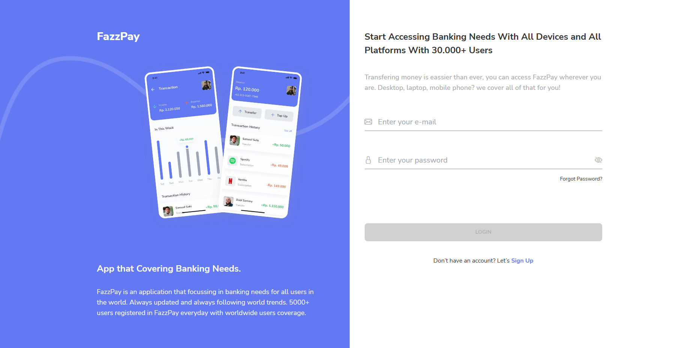
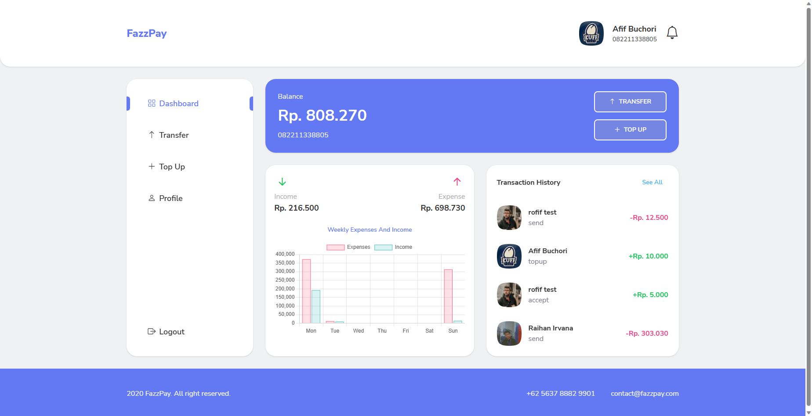
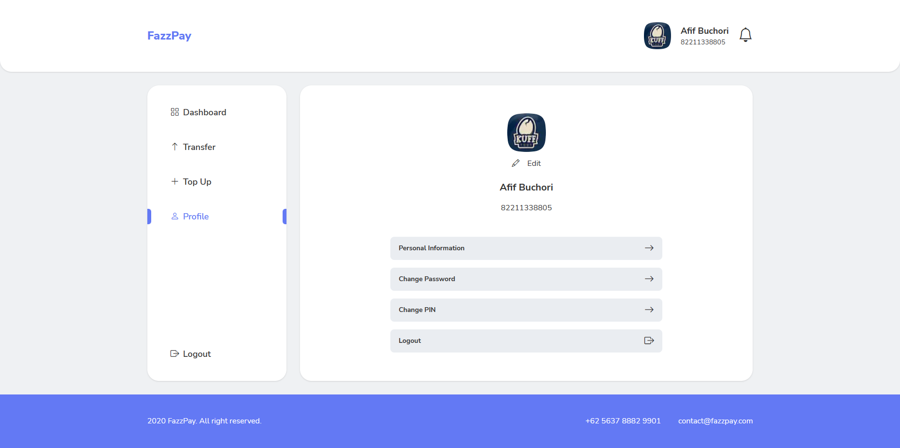
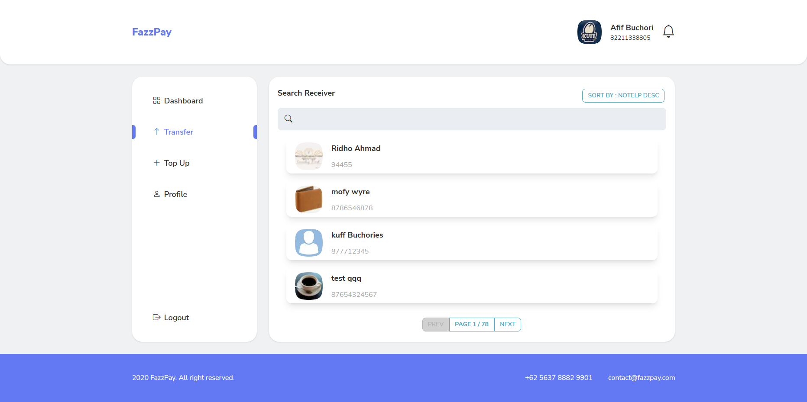
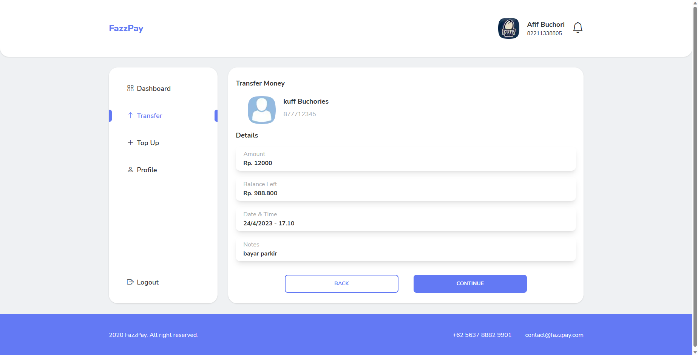
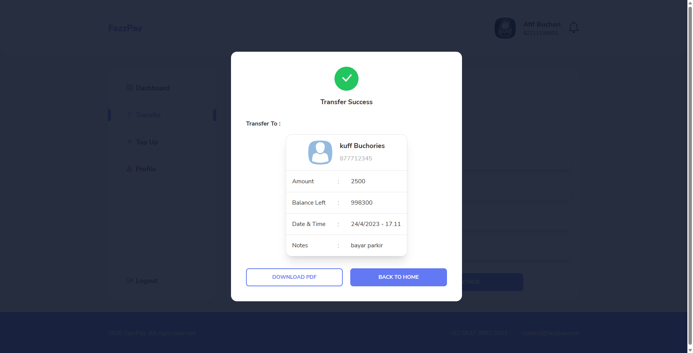
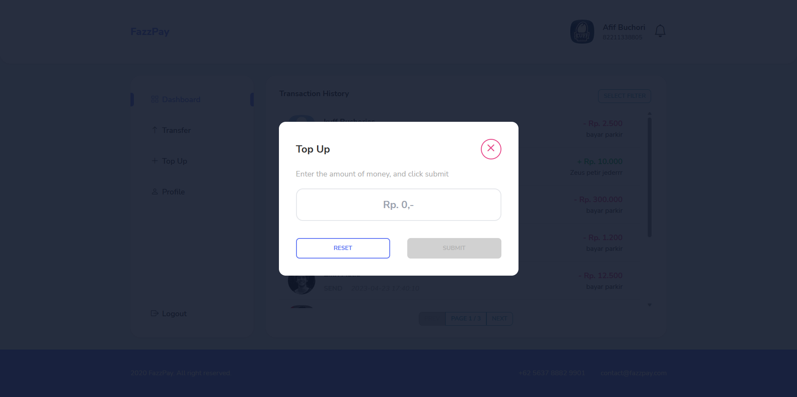

  <h2 align="center">FAZZPAY E-WALLET</h2>

  

    <a href="https://fazzpay-next.vercel.app/">View Demo</a>
    ·
    <a href="mailto:4fifbuchori@gmail.com">Report Bug</a>
    ·
    <a href="mailto:4fifbuchori@gmail.com">Request Feature</a>
  

## FazzPay E-Wallet

FazzPay E-Wallet is a web-based application for storing and managing electronic money.

## Build With

This application is built using React.js, Next.js, Redux, axios, Lodash, Chart.js, React-Pin-Field, TailwindCSS, and DaisyUI.

  

## Features

FazzPay E-Wallet has several main features:

- Electronic money storage
- Search for other users
- Sending electronic money to other users
- Transaction history
- Financial report with Chart.js graph

## How to run the application

To run the application, follow these steps:

1. Clone this repository to your computer.
2. Open a terminal in the repository directory and run the `npm install` command to install all required dependencies.
3. After it finishes, run the `npm run dev` command to run the application.
4. Open a browser and visit `http://localhost:3000` to see the application.

## Contributions

If you would like to contribute to this project, please send a pull request to this repository. We greatly appreciate your contributions.

## Documentation

  
  
  
  
  
  
  
  

